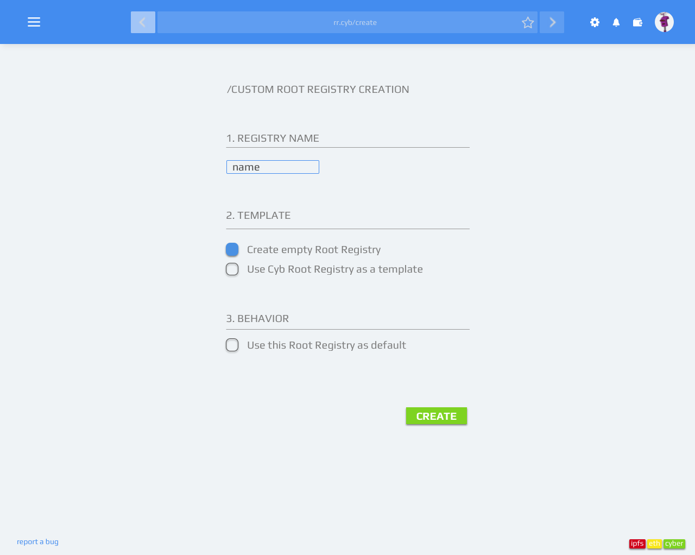
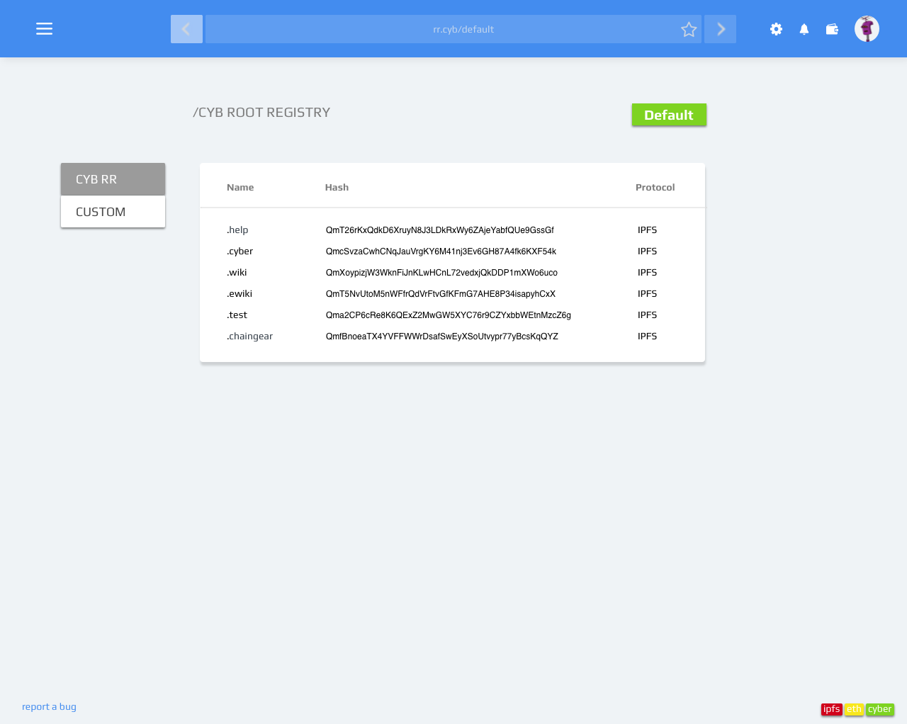
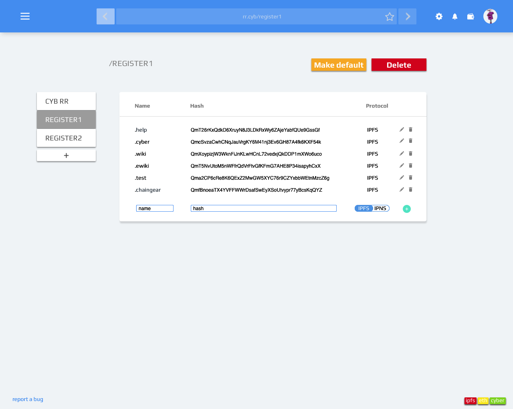

# Artboards

This is an autogenerated file showing all the artboards. Do not edit it directly.

## Background_menu

## Container

## Creation

## ETH_hash

## Empty register

## Filter

## Mempool

## Menu

## Overrides

## Root regisrty

## Search_bar

## Search_bar_close_side_bar

## Search_bar_open_side_bar

## Sidebar

## Template

## Wallet

## arrow

## btn

## btn

## ic

## il

## il_robohash

## links

## logo

## logo_2

## menu

## metamask

## search

## side_bar

## star

